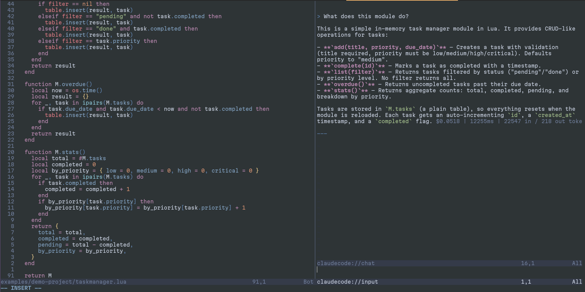
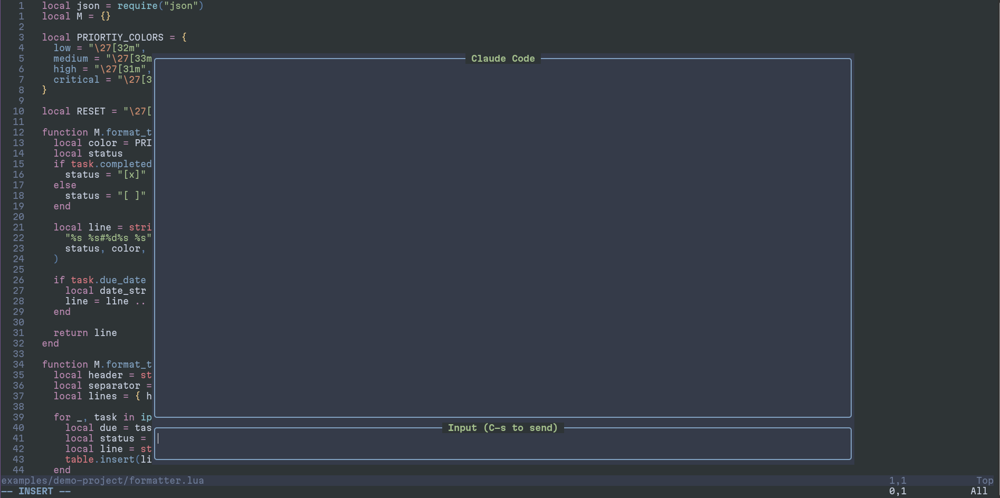
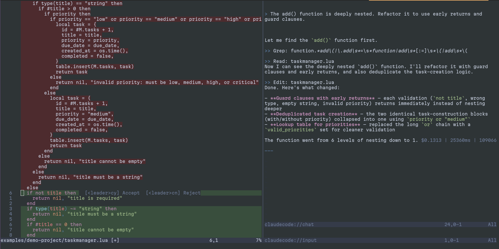
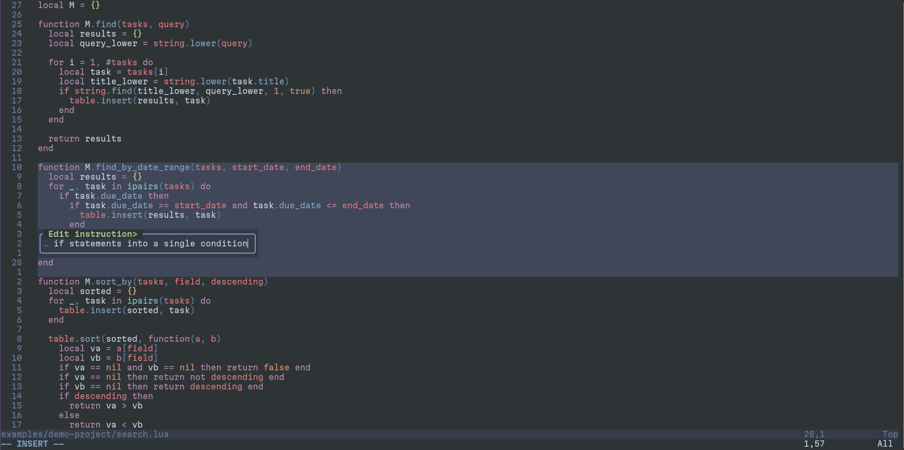
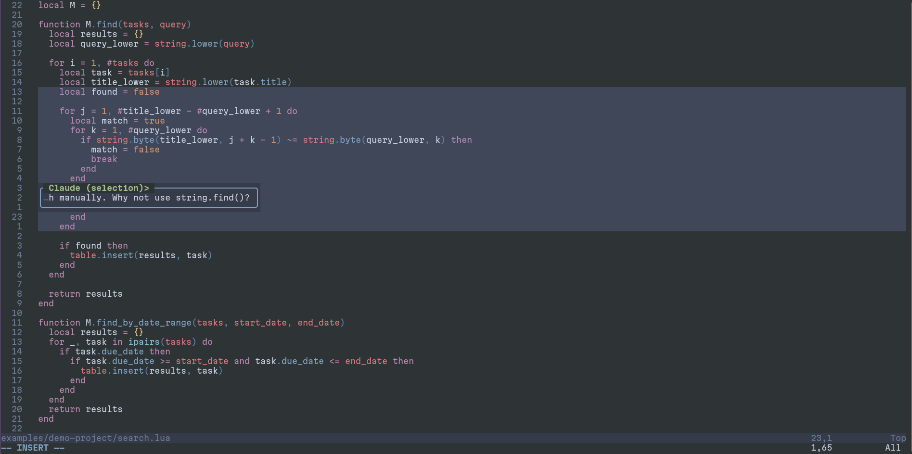
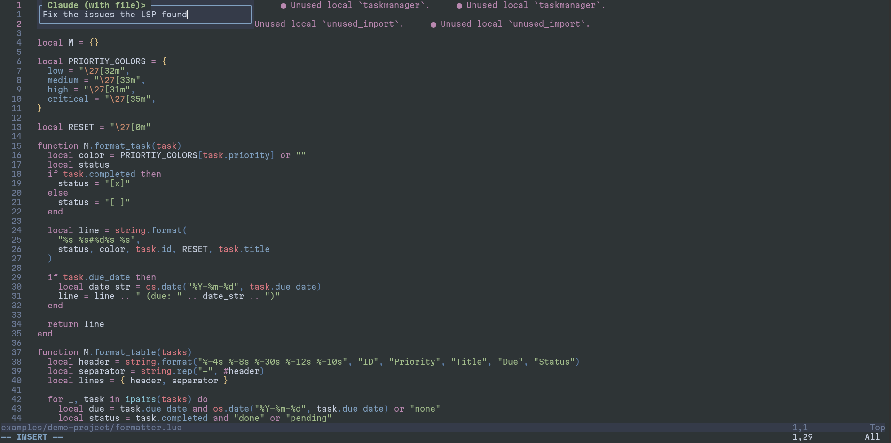
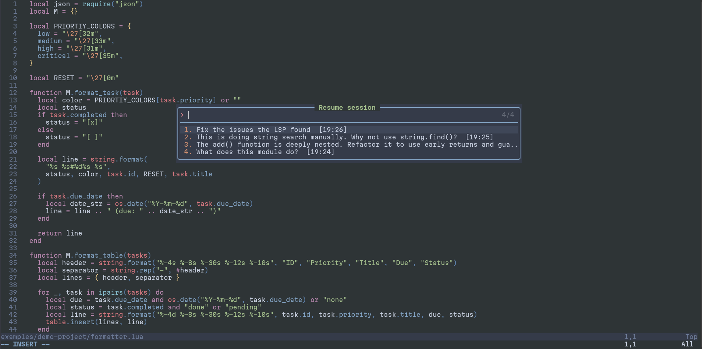
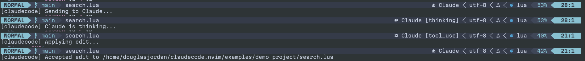
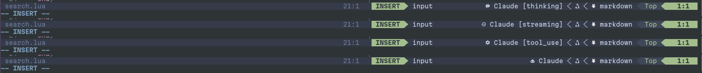

# claudecode.nvim

**Cursor-like AI coding in Neovim — powered by your Claude Code subscription.**

Use Claude as an AI pair programmer directly inside Neovim. Chat, send code selections, review inline diffs, and let Claude edit your files — all without leaving your editor. No API key needed, no per-token billing, fully ToS-compliant.

> If you have a [Claude Pro or Max](https://claude.ai/pricing) subscription with
> [Claude Code](https://docs.anthropic.com/en/docs/claude-code) enabled, you
> already have everything you need. This plugin talks to the official `claude` CLI —
> the same way Claude Code works in VS Code and JetBrains.



## Why claudecode.nvim?

| | Copilot | Cursor | Antigravity | API plugins | **claudecode.nvim** |
|---|---------|--------|-------------|-------------|---------------------|
| Editor | VS Code, Neovim, etc. | Cursor (VS Code fork) | Antigravity | Various | **Neovim** |
| Inline diffs | Yes | Yes | Yes | Varies | **Yes** |
| Chat with context | Yes | Yes | Yes | Varies | **Yes** |
| Session persistence | No | Yes | Yes | Varies | **Yes** |
| ToS-compliant | Yes | Yes | Yes | Yes | **Yes** |
| Works in your terminal | No | No | No | Varies | **Yes** |
| **Uses your existing Claude plan?** | **No** | **No** | **No** | **No** | **YES** |
| **NOT VS Code?** | **No** | **No** | **No** | **Varies** | **YES** |

### What you get

- **In-editor chat** — split or floating window, rendered markdown, tool use visibility

  
- **Inline diff viewer** — Claude proposes edits, you accept or reject per-hunk, just like Cursor

  
- **Inline edit** — select code, type an instruction, Claude edits it in-place (Cursor's Cmd+K)

  
- **Code context** — send the current file, a visual selection, or diagnostics as context

  

  
- **Session management** — resume previous conversations, start new ones

  
- **Statusline** — see Claude's state (idle/thinking/streaming/tool_use) in lualine or any statusline

  

  
- **Non-blocking** — a lightweight Rust bridge keeps your editor responsive while Claude thinks
- **Zero config billing** — uses your Claude Pro/Max subscription through the official CLI

## Requirements

- Neovim 0.10+
- [Claude Code CLI](https://docs.anthropic.com/en/docs/claude-code) (`claude` must be on your PATH)
- Rust toolchain (only if no prebuilt binary is available for your platform)
- [lualine.nvim](https://github.com/nvim-lualine/lualine.nvim) (optional, recommended for live statusline updates)

## Installation

### lazy.nvim

```lua
{
  "douglasjordan2/claudecode.nvim",
  build = function()
    require("claudecode.build").install()
  end,
  dependencies = {
    {
      "nvim-lualine/lualine.nvim",
      dependencies = { "nvim-tree/nvim-web-devicons" },
      config = function()
        require("lualine").setup({
          sections = {
            lualine_x = {
              "claudecode",
              "encoding", "fileformat", "filetype",
            },
          },
        })
      end,
    },
  },
  config = function()
    require("claudecode").setup()
  end,
}
```

Without lualine (statusline function still works with any statusline):

```lua
{
  "douglasjordan2/claudecode.nvim",
  build = function()
    require("claudecode.build").install()
  end,
  config = function()
    require("claudecode").setup()
  end,
}
```

### packer.nvim

```lua
use {
  "douglasjordan2/claudecode.nvim",
  run = function()
    require("claudecode.build").install()
  end,
  config = function()
    require("claudecode").setup()
  end,
}
```

### Manual

Clone the repo into your Neovim packages directory, then build the bridge:

```sh
cd ~/.local/share/nvim/site/pack/plugins/start/claudecode.nvim
lua -e "require('claudecode.build').install()"
```

## Quick Start

```lua
require("claudecode").setup()
```

Open Neovim and press `<leader>cc` to toggle the chat window, or run `:Claude hello` to send a message.

## Configuration

```lua
require("claudecode").setup({
  ui = {
    mode = "split",           -- "split" or "float"
    split_width = 80,         -- width of split panel
    float_width = 0.7,        -- float width (0-1 = fraction, >1 = pixels)
    float_height = 0.8,       -- float height (0-1 = fraction, >1 = pixels)
    border = "rounded",       -- border style for float windows
    input_min_height = 2,     -- minimum height of the input box
    input_max_height = 10,    -- maximum height of the input box
  },
  keymaps = {
    toggle = "<leader>cc",    -- toggle chat window
    send = "<leader>cs",      -- focus input
    context = "<leader>cx",   -- send with file context
    visual = "<leader>cv",    -- send visual selection
    inline_edit = "<leader>ce", -- inline edit selection
    abort = "<leader>ca",     -- abort current request
    accept_diff = "<leader>cy", -- accept diff in diff viewer
    reject_diff = "<leader>cn", -- reject diff in diff viewer
    sessions = "<leader>cl",  -- list/resume sessions
  },
  statusline = {
    icons = {
      idle = "󰚩",
      thinking = "󱜸",
      streaming = "󰊳",
      tool_use = "󰒓",
      error = "󰅚",
    },
  },
  truncation = {
    tool_result = 120,        -- max length for tool result display
    command = 60,             -- max length for command display
  },
  model = nil,                -- override Claude model
  allowed_tools = nil,        -- restrict available tools
  append_system_prompt = nil, -- append to system prompt
  permission_mode = nil,      -- permission mode for claude CLI
  binary_path = nil,          -- custom path to bridge binary
})
```

## Commands

| Command          | Description                              |
|------------------|------------------------------------------|
| `:Claude [msg]`  | Toggle chat, or send a message           |
| `:ClaudeChat`    | Open chat and focus input                |
| `:ClaudeAbort`   | Abort the active request                 |
| `:ClaudeSessions`| List and resume previous sessions        |
| `:ClaudeStatus`  | Show bridge status                       |
| `:ClaudeNew`     | Start a new session                      |

## Keymaps

### Global (normal mode)

| Key              | Action                     |
|------------------|----------------------------|
| `<leader>cc`     | Toggle chat window         |
| `<leader>cs`     | Focus chat input           |
| `<leader>cx`     | Send with file context     |
| `<leader>ca`     | Abort current request      |
| `<leader>cl`     | Session picker             |

### Visual mode

| Key              | Action                     |
|------------------|----------------------------|
| `<leader>cv`     | Send selection to Claude   |
| `<leader>ce`     | Inline edit selection       |

### Chat input buffer

| Key              | Action                     |
|------------------|----------------------------|
| `<C-s>` (insert) | Send message              |
| `<CR>` (normal)  | Send message              |
| `q` (normal)     | Close chat                |

### Diff viewer

| Key              | Action                     |
|------------------|----------------------------|
| `<leader>cy`     | Accept proposed edit       |
| `<leader>cn`     | Reject proposed edit       |

## Statusline

Add Claude's state to your statusline with animated spinner and state-based colors.

### lualine (recommended)

```lua
lualine_x = { "claudecode", "encoding", "fileformat", "filetype" }
```

The lualine component provides:
- Animated braille spinner while Claude is active
- Color-coded state using your colorscheme's diagnostic highlights (yellow for thinking, green for streaming, blue for tool_use, red for error)
- Auto-refresh during active states for smooth animation

### Custom statusline

```lua
vim.o.statusline = "%{v:lua.require('claudecode').statusline()}"
```

The basic `statusline()` function returns a formatted string with icon and state label. Customize icons via `statusline.icons` in config.

## How It Works

```
Neovim (Lua) <--stdin/stdout JSON-lines--> claudecode-bridge (Rust) <--spawns--> claude CLI
```

The plugin communicates with a Rust bridge binary over stdin/stdout using JSON-lines protocol. The bridge spawns the `claude` CLI process, streams its output, and forwards structured events back to Neovim. This architecture keeps the Lua side lightweight and avoids blocking the editor during long-running requests.

Because it uses the official `claude` CLI under the hood, this plugin is fully compliant with Anthropic's Terms of Service — it's the same interface that powers Claude Code in VS Code and JetBrains, just wired into Neovim.

## Troubleshooting

Run `:checkhealth claudecode` to diagnose common issues.

Common problems:

- **Bridge binary not found**: Run `:lua require('claudecode.build').install()` or build manually with `cd rust && cargo build --release`
- **`claude` not on PATH**: Install the Claude CLI and ensure it's accessible
- **No output after sending**: Check `:ClaudeStatus` to verify the bridge is running. Check stderr output in the chat buffer for errors from the CLI.

## Contributing

**WANTED: better screenshots!** The current screenshots are functional but rough. If you have a nice terminal setup and want to contribute polished screenshots or GIFs showing off the features, PRs are very welcome.

## License

MIT
